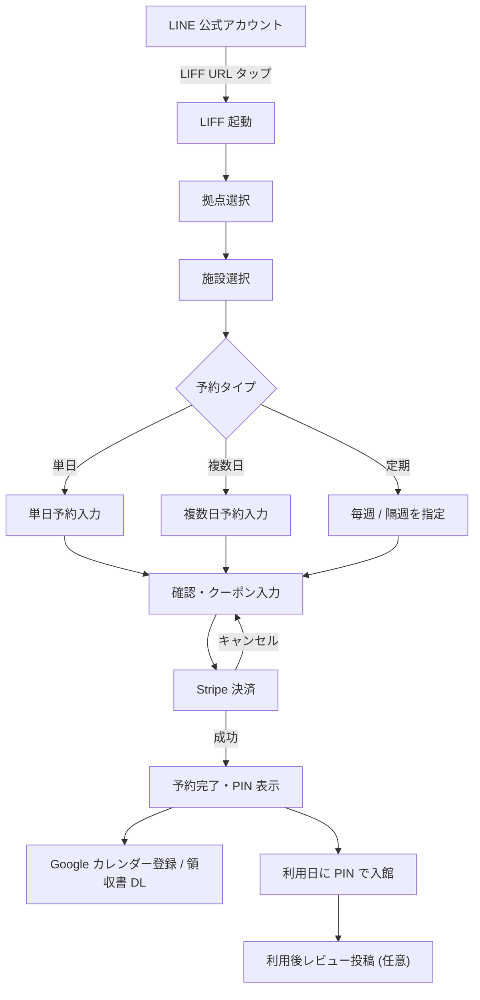
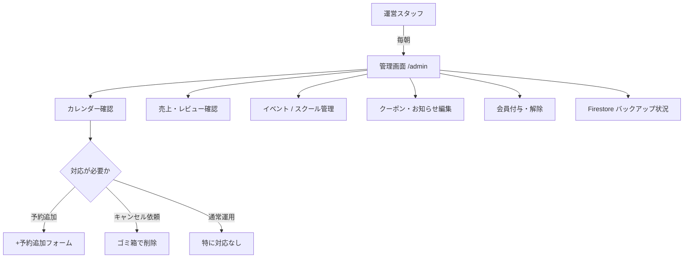
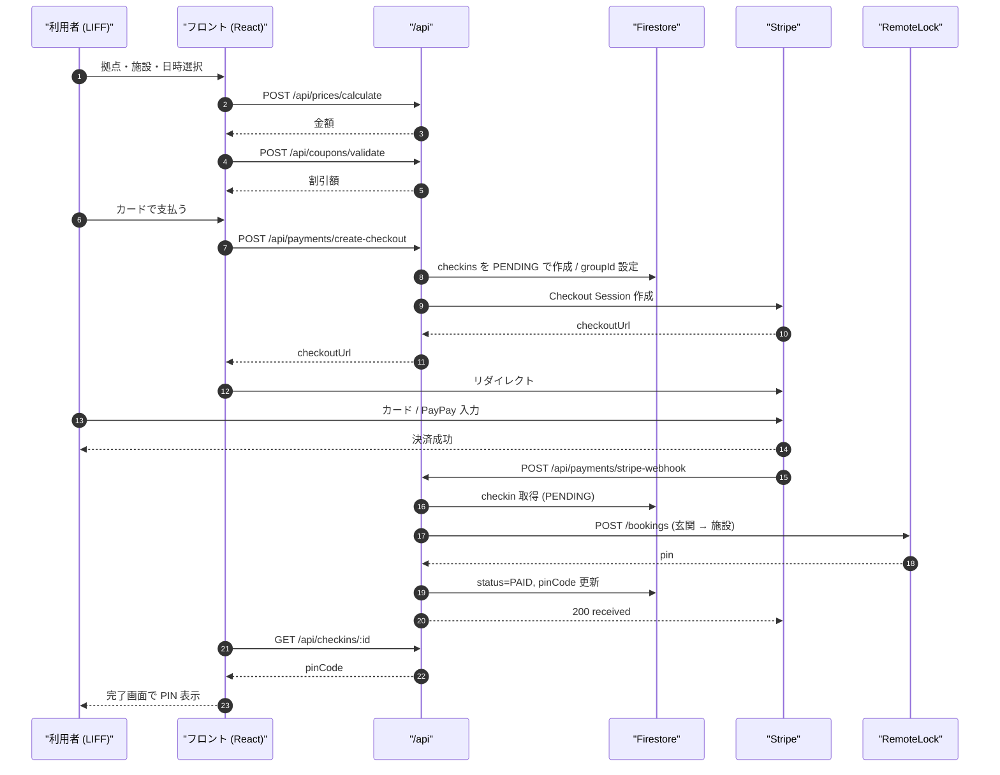
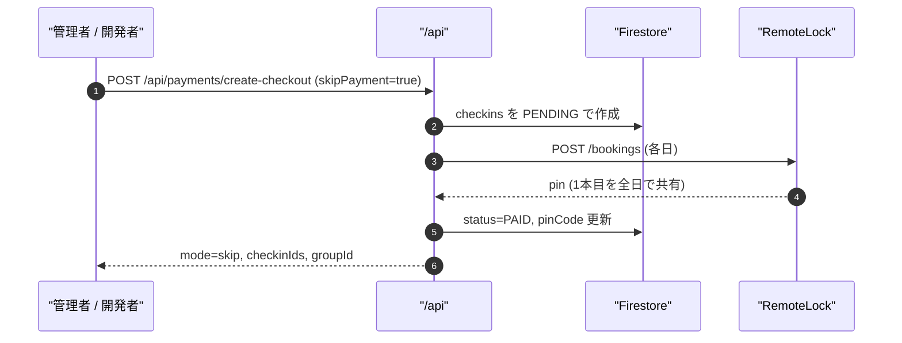
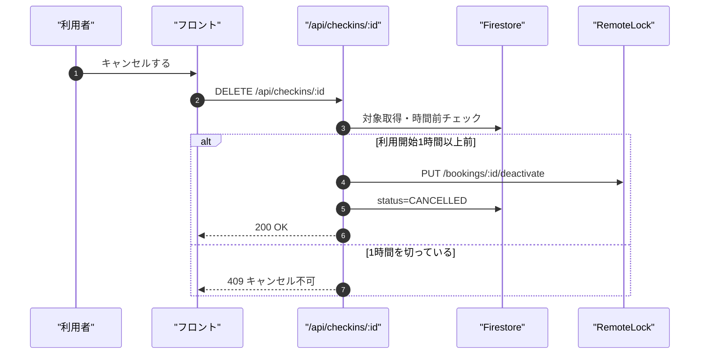
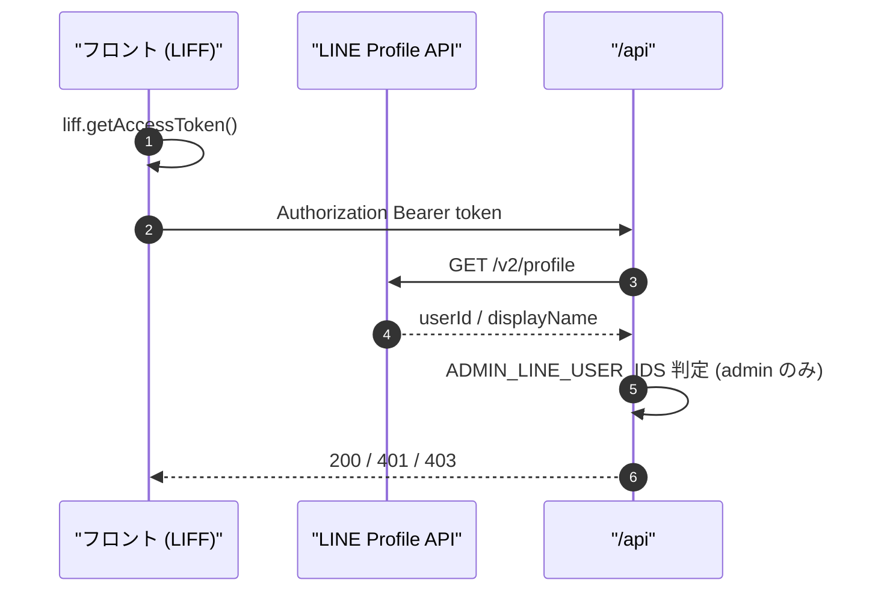
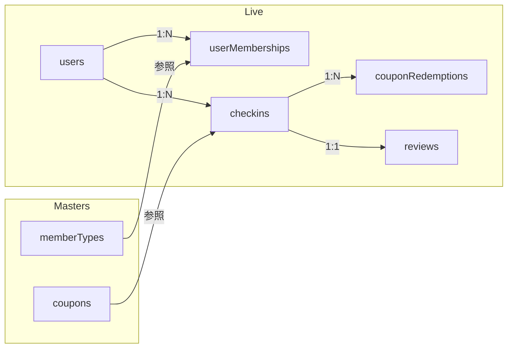
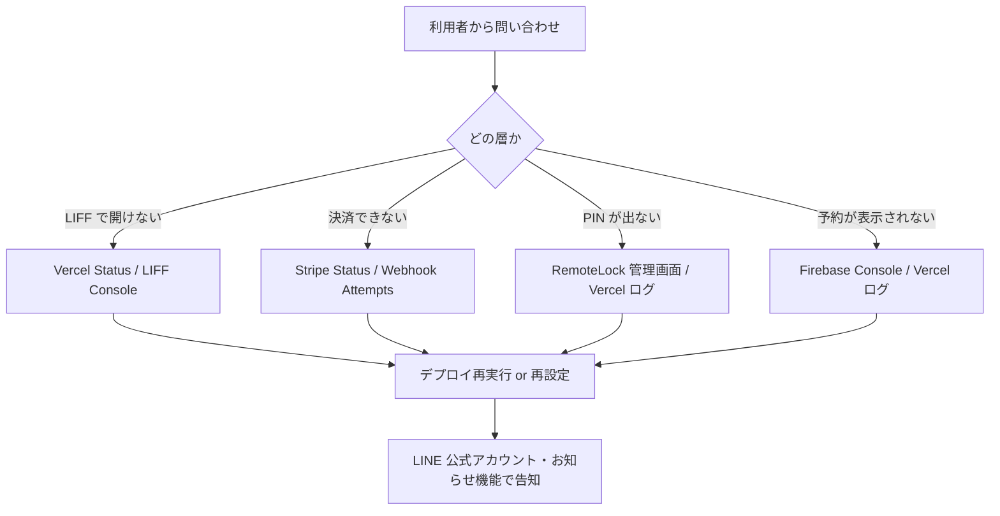
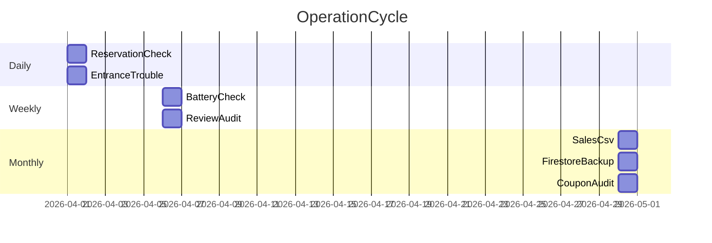

# 11. 運用フロー・システムフロー

フローは **Mermaid** 記法で記述しています。GitHub / 対応エディタ上でそのまま図として表示されます。

> 💡 Mermaid 8.8 系など古いバージョンでも描画できるよう、`graph` 記法・ダブルクォートでのラベル保護で統一しています。

---

## 1. 業務フロー（利用者）

## 2. 業務フロー（運営・管理）

---

## 3. システムフロー — 予約〜決済〜PIN 発行（Stripe モード）

---

## 4. システムフロー — 決済スキップ（管理者予約／デバッグ）

---

## 5. システムフロー — キャンセル

---

## 6. 認可フロー

---

## 7. データフロー（会員・クーポン・決済）

---

## 8. 障害時フロー

---

## 9. 日次・月次運用（運用カレンダー）

> 💡 旧版 Mermaid の Gantt は日本語タイトル/タスク名で描画に失敗する場合があるため、ここだけ英数字で記述しています。

---

## 参考: 運用リズム（日本語表）

| 周期 | タスク |
|---|---|
| 日次 | 予約確認、入館トラブル対応 |
| 週次 | RemoteLock 電池残量チェック、レビュー棚卸し |
| 月次 | 売上 CSV 経理連携、Firestore バックアップ確認、クーポン棚卸し |
